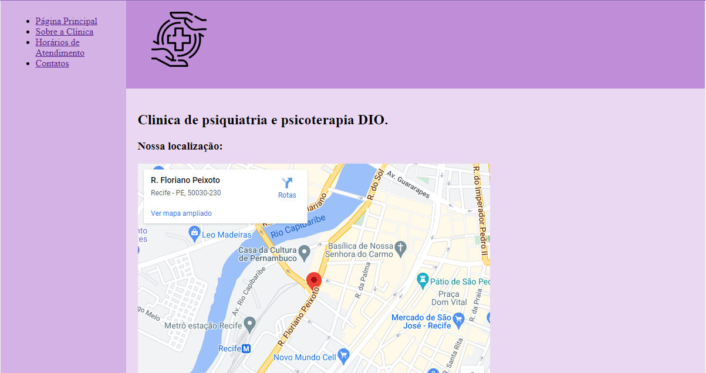
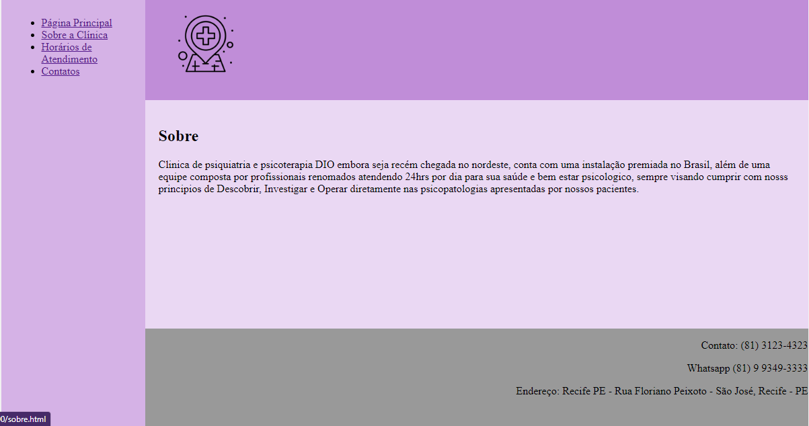
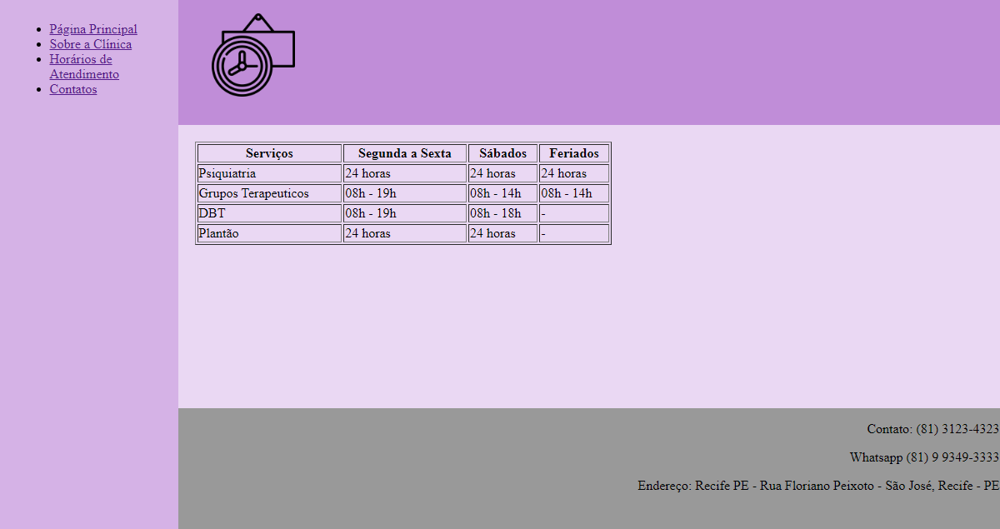
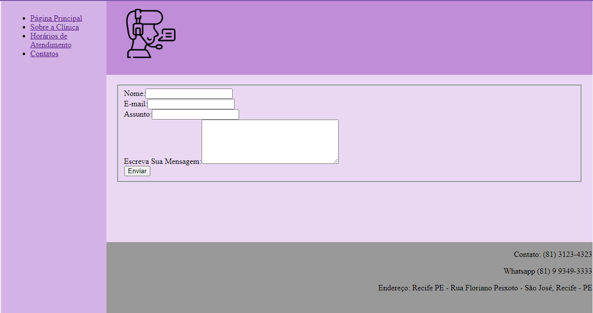

<h1 align="center"> Clínica DIO </h1>
<h2 align="center">Desafio HTML - trilha modulo II </h2>

<h1 align="center">  </h1>
<h1 align="center">  </h1>
<h1 align="center">  </h1>
<h1 align="center">  </h1>
